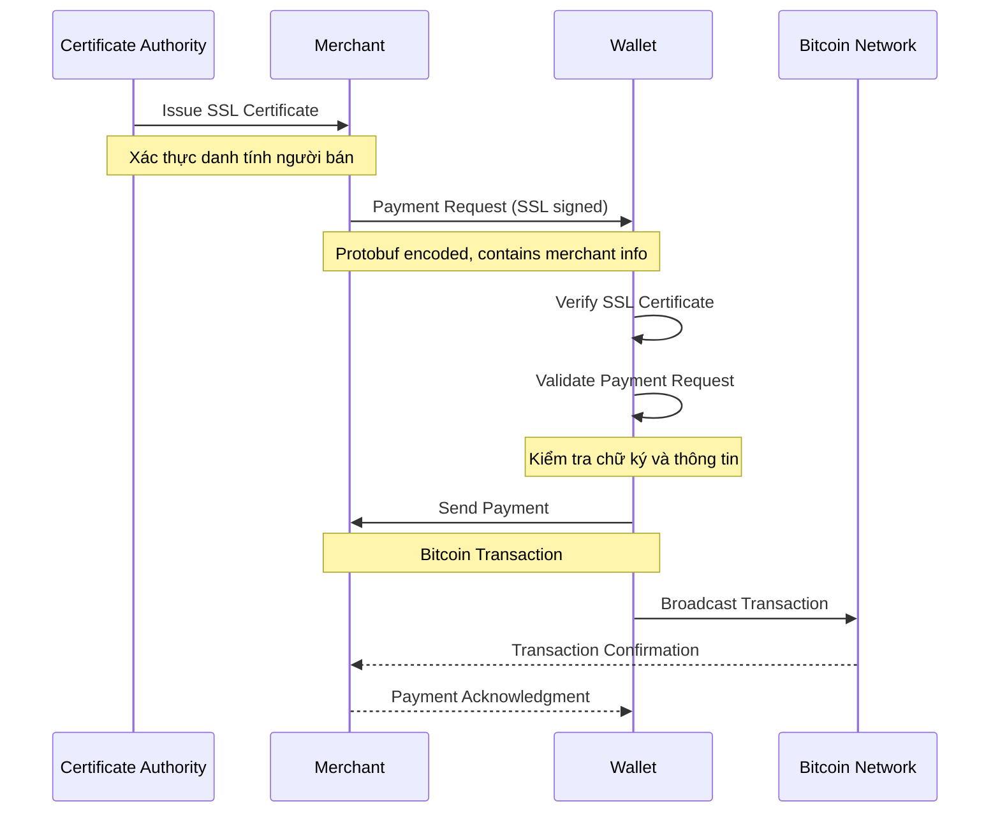
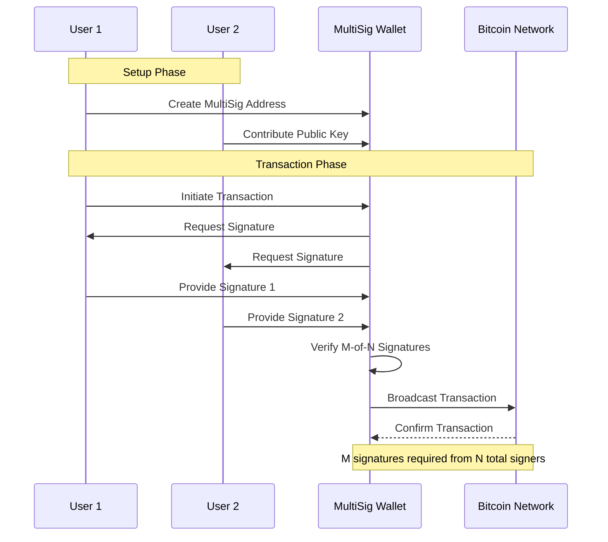

# Báo cáo: BIP70 và MultiSign trong Blockchain

## Phần 1: BIP70 - Giao thức Thanh toán Bitcoin

### 1.1 Tổng quan về BIP70

BIP70 là một giao thức thanh toán tiên tiến trong hệ sinh thái Bitcoin, được thiết kế để tạo ra một kênh giao tiếp an toàn và đáng tin cậy giữa người mua và người bán. Giao thức này tích hợp các công nghệ bảo mật tiên tiến như SSL/TLS và PKI để đảm bảo tính xác thực và toàn vẹn của giao dịch.


### 1.2 Cơ sở Hạ tầng

#### 1.2.1 PKI (Public Key Infrastructure)

PKI trong BIP70 hoạt động như sau:

1. Tạo và Quản lý Khóa:
    - Người bán tạo cặp khóa công khai/bí mật
    - Khóa công khai được đăng ký với Certificate Authority
    - Khóa bí mật được bảo vệ nghiêm ngặt

2. Xác thực Danh tính:
    - CA xác minh danh tính của người bán
    - Phát hành chứng chỉ số chứa thông tin xác thực
    - Chứng chỉ được ký bởi CA để đảm bảo tính xác thực

#### 1.2.2 SSL/TLS

Vai trò của SSL/TLS trong BIP70:

1. Thiết lập Kết nối An toàn:
    - Tạo kênh mã hóa giữa người mua và người bán
    - Sử dụng phương pháp bắt tay (handshake) để trao đổi khóa
    - Đảm bảo tính bí mật và toàn vẹn dữ liệu

2. Mã hóa Dữ liệu:
    - Sử dụng mã hóa đối xứng cho dữ liệu phiên
    - Bảo vệ thông tin thanh toán khỏi bị nghe lén
    - Xác thực nguồn gốc thông điệp

Dựa trên tài liệu đã cung cấp, tôi sẽ viết lại phần này một cách chi tiết và chính xác hơn:

### 1.3 Quy trình Hoạt động của BIP70



Quy trình hoạt động của BIP70 là một quy trình phức tạp, sử dụng hệ thống PKI (Public Key Infrastructure) và SSL để đảm bảo tính an toàn trong giao dịch. Quy trình này bao gồm các giai đoạn chính sau:

1. Thiết lập Hệ thống PKI:
    - Thương gia phải đăng ký với một Certificate Authority (CA) để được cấp chứng chỉ SSL
    - CA thực hiện xác minh danh tính của thương gia một cách kỹ lưỡng
    - Sau khi xác minh, CA cấp chứng chỉ SSL chứa khóa công khai của thương gia
    - Thương gia cài đặt chứng chỉ này vào hệ thống của họ

2. Khởi tạo Yêu cầu Thanh toán:
    - Thương gia tạo yêu cầu thanh toán bao gồm các thông tin chi tiết về giao dịch
    - Yêu cầu này được mã hóa sử dụng Protocol Buffers của Google
    - Thương gia ký số yêu cầu thanh toán bằng khóa riêng của họ
    - Yêu cầu thanh toán được gửi đến ví của khách hàng

3. Quy trình Xác thực:
    - Ví Bitcoin của khách hàng nhận yêu cầu thanh toán
    - Ví thực hiện kiểm tra tính hợp lệ của chứng chỉ SSL
    - Xác minh chữ ký số của thương gia thông qua hệ thống PKI
    - Kiểm tra các thông tin trong yêu cầu thanh toán
    - Hiển thị thông tin thanh toán đã được xác thực cho người dùng

4. Hoàn tất Giao dịch:
    - Người dùng xem xét và xác nhận thông tin thanh toán
    - Ví tạo và ký giao dịch Bitcoin
    - Giao dịch được phát tán lên mạng Bitcoin
    - Thương gia nhận được xác nhận giao dịch
    - Gửi thông báo xác nhận thanh toán về cho ví người dùng
   
## Phần 2: MultiSign - Công nghệ Ví Đa Chữ ký


### 2.1 Nguyên lý Hoạt động



Quy trình hoạt động của MultiSign được thể hiện trong sơ đồ thứ hai, với các giai đoạn:

1. Thiết lập Ví:
    - Xác định cấu hình M-of-N
    - Tạo khóa cho mỗi người ký
    - Tạo địa chỉ MultiSig

2. Khởi tạo Giao dịch:
    - Một bên tạo giao dịch
    - Hệ thống yêu cầu đủ số chữ ký
    - Thu thập chữ ký từ các bên

3. Xác nhận và Phát sóng:
    - Kiểm tra đủ số lượng chữ ký
    - Kết hợp các chữ ký
    - Phát sóng giao dịch lên mạng

### 2.2 Ứng dụng Thực tế

1. Quản lý Tài sản Doanh nghiệp:
    - Phân quyền cho nhiều người quản lý
    - Kiểm soát chi tiêu tập thể
    - Tăng tính minh bạch

2. Bảo mật Ví Cá nhân:
    - Tạo nhiều lớp bảo vệ
    - Phục hồi trong trường hợp mất khóa
    - Phân chia quyền kiểm soát

## Phần 3: So sánh và Đánh giá

### 3.1 Ưu điểm và Hạn chế

BIP70:
- Ưu điểm: Tạo kênh giao tiếp an toàn, xác thực danh tính người bán
- Hạn chế: Phụ thuộc vào PKI, độ phức tạp cao

MultiSign:
- Ưu điểm: Bảo mật cao, linh hoạt trong quản lý
- Hạn chế: Chi phí cao hơn, thời gian xử lý lâu

### 3.2 Xu hướng Phát triển

Trong khi BIP70 đang dần được thay thế bởi các giải pháp đơn giản hơn BIP21 (Chủ yếu dùng URI, thật ra là quay lại), MultiSign tiếp tục phát triển và được áp dụng rộng rãi trong các ứng dụng yêu cầu bảo mật cao và quản lý tài sản tập thể.

Tôi sẽ thêm phần "Kịch bản sử dụng" vào README.md sau phần báo cáo BIP70 và MultiSign. Đây là nội dung bổ sung:


## Phần 4: Kịch bản Sử dụng và Triển khai

### 4.1. Kịch bản 1: Quản lý Quỹ Đầu tư Chung

#### Mô tả
- Đối tượng: Nhóm 3 nhà đầu tư
- Mục đích: Quản lý quỹ đầu tư chung
- Yêu cầu: Minh bạch, an toàn, linh hoạt

#### Thiết lập
```javascript
Cấu hình ban đầu:
- Owners: 3 địa chỉ ví của các nhà đầu tư
- Required: 2 (yêu cầu 2/3 chữ ký)
- Threshold: 0.5 ETH (ngưỡng tự động)
```

#### Quy trình hoạt động
1. Nạp tiền vào quỹ:
   - Mỗi nhà đầu tư chuyển ETH vào địa chỉ contract
   - Kiểm tra số dư qua dashboard

2. Quản lý đầu tư:
   - Giao dịch < 0.5 ETH: Tự động thực hiện
   - Giao dịch > 0.5 ETH:
      * Tạo đề xuất giao dịch
      * Thu thập 2/3 chữ ký
      * Thực thi sau khi đủ chữ ký

3. Giám sát:
   - Theo dõi lịch sử giao dịch
   - Kiểm tra trạng thái phê duyệt
   - Xem số dư real-time

### 4.2. Kịch bản 2: Quản lý Ngân sách Dự án

#### Mô tả
- Đối tượng: Team 3 người (PM, Tech Lead, Finance Officer)
- Mục đích: Quản lý chi tiêu dự án
- Đặc điểm: PM có quyền admin

#### Thiết lập
```javascript
Cấu hình:
- Owners: [PM, Tech Lead, Finance Officer]
- Required: 2 chữ ký
- Threshold: 0.3 ETH
```

#### Quy trình quản lý
1. Chi tiêu nhỏ (< 0.3 ETH):
   - Tự động phê duyệt
   - Ghi log chi tiết

2. Chi tiêu lớn (> 0.3 ETH):
   - Member tạo yêu cầu
   - PM + 1 thành viên phê duyệt
   - Thực thi trong deadline 2 phút

3. Quyền Admin (PM):
   - Thêm/xóa thành viên
   - Điều chỉnh ngưỡng
   - Pause contract khi cần

### 4.3. Kịch bản 3: Quản lý Tài sản Gia đình

#### Mô tả
- Đối tượng: Gia đình 3 thành viên
- Mục đích: Quản lý tài sản chung
- Đặc điểm: Phân quyền theo vai trò

#### Thiết lập
```javascript
Cấu hình:
- Owners: [Cha (Admin), Mẹ, Con]
- Required: 2 chữ ký
- Threshold: 0.1 ETH
```

#### Quy trình sử dụng
1. Chi tiêu hàng ngày (< 0.1 ETH):
   - Bất kỳ ai cũng có thể tạo
   - Tự động phê duyệt
   - Tracking chi tiêu

2. Chi tiêu lớn (> 0.1 ETH):
   - Con tạo yêu cầu
   - Cần phê duyệt của cha mẹ
   - Có thể gia hạn deadline

3. Quản lý:
   - Cha có quyền hủy giao dịch
   - Theo dõi lịch sử chi tiêu
   - Điều chỉnh hạn mức

### 4.4. Kịch bản 4: Quản lý Quỹ DAO

#### Mô tả
- Đối tượng: DAO với 3 thành viên hội đồng
- Mục đích: Quản lý quỹ phát triển
- Yêu cầu: Minh bạch tối đa

#### Thiết lập
```javascript
Cấu hình:
- Owners: 3 council members
- Required: 2/3 chữ ký
- Threshold: 1.0 ETH
```

#### Quy trình vận hành
1. Giao dịch thường (< 1 ETH):
   - Tự động thực hiện
   - Log đầy đủ thông tin

2. Giao dịch lớn (> 1 ETH):
   - Tạo proposal
   - Thu thập 2/3 chữ ký
   - Tracking quá trình phê duyệt

3. Quản trị:
   - Điều chỉnh threshold
   - Thêm/xóa council member
   - Emergency pause

### 4.5. Hướng dẫn Triển khai

1. Chuẩn bị:
   - Cài đặt MetaMask
   - Kết nối testnet
   - Chuẩn bị ETH test

2. Deploy Contract:
   ```bash
   # Cấu hình owners
   _owners = [
       "0xf9340cf908f039Db5F588b79286dc62D84ba5098",
       "0xE1B37097C7b93DE17fcFc988f9789e89A6cE836e",
       "0x394409D8630eC3bDA1A661b01424220Da42cdfaA"
   ];
   
   # Cấu hình parameters
   _required = 2;
   _threshold = 1.0;
   ```

3. Khởi tạo Frontend:
   ```bash
   # Cài đặt dependencies
   npm install
   
   # Cập nhật địa chỉ contract
   MULTISIG_ADDRESS=<contract_address>
   
   # Chạy ứng dụng
   npm start
   ```

4. Sử dụng:
   - Connect wallet
   - Nạp ETH vào contract
   - Tạo và quản lý giao dịch
   - Theo dõi trên dashboard

### 4.6. Các Tính năng Chính

1. Quản lý Giao dịch:
   - Tạo giao dịch mới
   - Phê duyệt/Từ chối
   - Theo dõi trạng thái
   - Auto-approve với small tx

2. Quản trị:
   - Thêm/xóa owners
   - Điều chỉnh threshold
   - Quản lý deadline
   - Emergency controls

3. Giám sát:
   - Real-time balance
   - Transaction history
   - Approval tracking
   - Deadline monitoring

4. Bảo mật:
   - Multi-signature
   - Threshold control
   - Time locks
   - Emergency pause

### 4.7. Best Practices

1. Bảo mật:
   - Backup private keys
   - Verify transaction info
   - Check gas settings
   - Monitor balances

2. Quản lý:
   - Set appropriate thresholds
   - Regular monitoring
   - Clear documentation
   - Training for members

3. Quy trình:
   - Define clear procedures
   - Regular audits
   - Emergency protocols
   - Update policies

4. Kỹ thuật:
   - Test thoroughly
   - Monitor gas prices
   - Regular updates
   - Backup solutions
```

Phần này cung cấp hướng dẫn chi tiết cho việc triển khai và sử dụng MultiSig Wallet trong các kịch bản khác nhau, giúp người dùng dễ dàng áp dụng vào thực tế. Mỗi kịch bản đều có hướng dẫn cụ thể về cấu hình và quy trình vận hành.