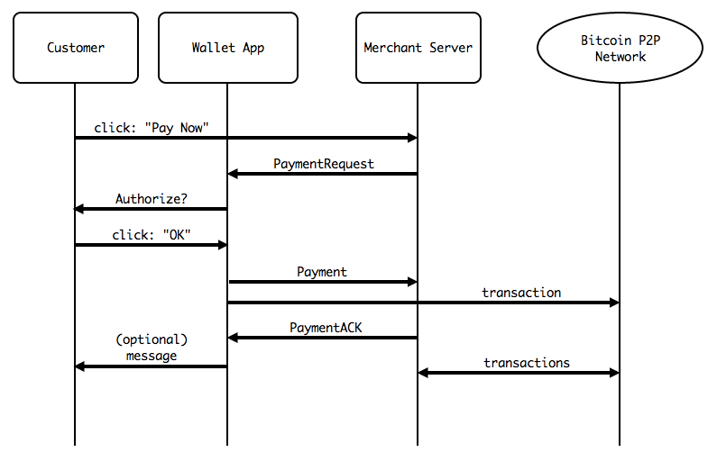
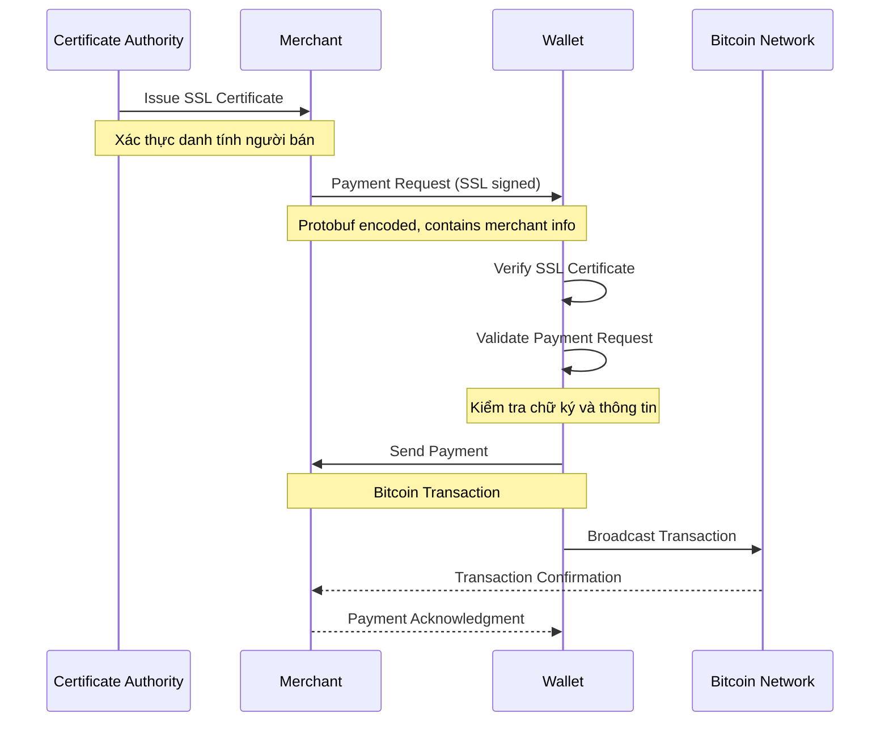
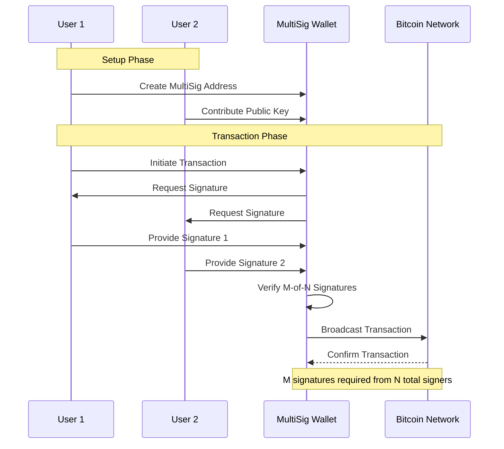

# Báo cáo: BIP70 và MultiSign trong Blockchain

## Phần 1: BIP70 - Giao thức Thanh toán Bitcoin

### 1.1 Tổng quan về BIP70

BIP70 là một giao thức thanh toán tiên tiến trong hệ sinh thái Bitcoin, được thiết kế để tạo ra một kênh giao tiếp an toàn và đáng tin cậy giữa người mua và người bán. Giao thức này tích hợp các công nghệ bảo mật tiên tiến như SSL/TLS và PKI để đảm bảo tính xác thực và toàn vẹn của giao dịch.



### 1.2 Cơ sở Hạ tầng

#### 1.2.1 PKI (Public Key Infrastructure)

PKI trong BIP70 hoạt động như sau:

1. Tạo và Quản lý Khóa:
    - Người bán tạo cặp khóa công khai/bí mật
    - Khóa công khai được đăng ký với Certificate Authority
    - Khóa bí mật được bảo vệ nghiêm ngặt

2. Xác thực Danh tính:
    - CA xác minh danh tính của người bán
    - Phát hành chứng chỉ số chứa thông tin xác thực
    - Chứng chỉ được ký bởi CA để đảm bảo tính xác thực

#### 1.2.2 SSL/TLS

Vai trò của SSL/TLS trong BIP70:

1. Thiết lập Kết nối An toàn:
    - Tạo kênh mã hóa giữa người mua và người bán
    - Sử dụng phương pháp bắt tay (handshake) để trao đổi khóa
    - Đảm bảo tính bí mật và toàn vẹn dữ liệu

2. Mã hóa Dữ liệu:
    - Sử dụng mã hóa đối xứng cho dữ liệu phiên
    - Bảo vệ thông tin thanh toán khỏi bị nghe lén
    - Xác thực nguồn gốc thông điệp

Dựa trên tài liệu đã cung cấp, tôi sẽ viết lại phần này một cách chi tiết và chính xác hơn:

### 1.3 Quy trình Hoạt động của BIP70



Quy trình hoạt động của BIP70 là một quy trình phức tạp, sử dụng hệ thống PKI (Public Key Infrastructure) và SSL để đảm bảo tính an toàn trong giao dịch. Quy trình này bao gồm các giai đoạn chính sau:

1. Thiết lập Hệ thống PKI:
    - Thương gia phải đăng ký với một Certificate Authority (CA) để được cấp chứng chỉ SSL
    - CA thực hiện xác minh danh tính của thương gia một cách kỹ lưỡng
    - Sau khi xác minh, CA cấp chứng chỉ SSL chứa khóa công khai của thương gia
    - Thương gia cài đặt chứng chỉ này vào hệ thống của họ

2. Khởi tạo Yêu cầu Thanh toán:
    - Thương gia tạo yêu cầu thanh toán bao gồm các thông tin chi tiết về giao dịch
    - Yêu cầu này được mã hóa sử dụng Protocol Buffers của Google
    - Thương gia ký số yêu cầu thanh toán bằng khóa riêng của họ
    - Yêu cầu thanh toán được gửi đến ví của khách hàng

3. Quy trình Xác thực:
    - Ví Bitcoin của khách hàng nhận yêu cầu thanh toán
    - Ví thực hiện kiểm tra tính hợp lệ của chứng chỉ SSL
    - Xác minh chữ ký số của thương gia thông qua hệ thống PKI
    - Kiểm tra các thông tin trong yêu cầu thanh toán
    - Hiển thị thông tin thanh toán đã được xác thực cho người dùng

4. Hoàn tất Giao dịch:
    - Người dùng xem xét và xác nhận thông tin thanh toán
    - Ví tạo và ký giao dịch Bitcoin
    - Giao dịch được phát tán lên mạng Bitcoin
    - Thương gia nhận được xác nhận giao dịch
    - Gửi thông báo xác nhận thanh toán về cho ví người dùng
   
## Phần 2: MultiSign - Công nghệ Ví Đa Chữ ký


### 2.1 Nguyên lý Hoạt động



Quy trình hoạt động của MultiSign được thể hiện trong sơ đồ thứ hai, với các giai đoạn:

1. Thiết lập Ví:
    - Xác định cấu hình M-of-N
    - Tạo khóa cho mỗi người ký
    - Tạo địa chỉ MultiSig

2. Khởi tạo Giao dịch:
    - Một bên tạo giao dịch
    - Hệ thống yêu cầu đủ số chữ ký
    - Thu thập chữ ký từ các bên

3. Xác nhận và Phát sóng:
    - Kiểm tra đủ số lượng chữ ký
    - Kết hợp các chữ ký
    - Phát sóng giao dịch lên mạng

### 2.2 Ứng dụng Thực tế

1. Quản lý Tài sản Doanh nghiệp:
    - Phân quyền cho nhiều người quản lý
    - Kiểm soát chi tiêu tập thể
    - Tăng tính minh bạch

2. Bảo mật Ví Cá nhân:
    - Tạo nhiều lớp bảo vệ
    - Phục hồi trong trường hợp mất khóa
    - Phân chia quyền kiểm soát

## Phần 3: So sánh và Đánh giá

### 3.1 Ưu điểm và Hạn chế

BIP70:
- Ưu điểm: Tạo kênh giao tiếp an toàn, xác thực danh tính người bán
- Hạn chế: Phụ thuộc vào PKI, độ phức tạp cao

MultiSign:
- Ưu điểm: Bảo mật cao, linh hoạt trong quản lý
- Hạn chế: Chi phí cao hơn, thời gian xử lý lâu

### 3.2 Xu hướng Phát triển

Trong khi BIP70 đang dần được thay thế bởi các giải pháp đơn giản hơn BIP21 (Chủ yếu dùng URI, thật ra là quay lại), MultiSign tiếp tục phát triển và được áp dụng rộng rãi trong các ứng dụng yêu cầu bảo mật cao và quản lý tài sản tập thể.

Tôi sẽ thêm phần "Kịch bản sử dụng" vào README.md sau phần báo cáo BIP70 và MultiSign. Đây là nội dung bổ sung:


Tôi sẽ viết lại 4 kịch bản phù hợp với source code hiện tại của MultiSigWallet.sol. Tôi sẽ tập trung vào các tính năng thực tế mà smart contract hỗ trợ:

# Kịch bản Sử dụng và Triển khai Smart Contract MultiSigWallet

## 4.1. Kịch bản: Quản lý Chi tiêu Thông minh cho Con cái

### Bối cảnh và Mục tiêu
Trong kỷ nguyên số, việc giáo dục tài chính cho thế hệ trẻ đòi hỏi những phương pháp sáng tạo và hiệu quả. Smart contract MultiSigWallet mang đến giải pháp tối ưu, cho phép cha mẹ xây dựng nền tảng tài chính vững chắc cho con cái thông qua việc kết hợp tự do và kiểm soát một cách cân bằng.

### Cấu trúc Tham gia
```javascript
const owners = [
    "0xp01...", // Ví của Bố - Quyền quản trị
    "0xp02...", // Ví của Mẹ - Quyền quản trị  
    "0xp03..."  // Ví của Con - Quyền thực hiện giao dịch
];
const required = 2;  // Cần 2/3 chữ ký
const threshold = web3.utils.toWei("0.05", "ether"); // Ngưỡng 0.05 ETH
```

### Quy trình Hoạt động

#### 1. Quản lý Chi tiêu Nhỏ (< 0.05 ETH)
- Con được tự do thực hiện giao dịch nhỏ
- Giao dịch tự động được thực thi và ghi nhận
- Phụ huynh theo dõi qua hệ thống thông báo

#### 2. Kiểm soát Chi tiêu Lớn (≥ 0.05 ETH)
- Con tạo yêu cầu với thông tin chi tiết
- Thời hạn xem xét 2 phút
- Cần phê duyệt từ ít nhất một phụ huynh
- Có thể điều chỉnh thời hạn khi cần

#### 3. Công cụ Giám sát
- Dashboard theo dõi chi tiêu thời gian thực
- Báo cáo định kỳ về hành vi tài chính
- Đề xuất điều chỉnh ngưỡng chi tiêu
- Đánh giá mức độ trưởng thành tài chính

## 4.2. Kịch bản: Quản lý Quỹ Đầu tư Crypto Chuyên nghiệp

### Bối cảnh và Mục tiêu
Trong thị trường crypto biến động nhanh, các nhà đầu tư chuyên nghiệp cần một hệ thống quản lý danh mục đầu tư an toàn và linh hoạt. MultiSigWallet cung cấp cơ chế kiểm soát đa lớp để bảo vệ tài sản và tối ưu hóa cơ hội đầu tư.

### Cấu trúc Tham gia
```javascript
const owners = [
    "0xf01...", // Quản lý Danh mục
    "0xf02...", // Chuyên gia Phân tích
    "0xf03...", // Giám đốc Rủi ro
    "0xf04...", // Người thực thi Giao dịch
    "0xf05..."  // Kiểm soát viên
];
const required = 3;  // Yêu cầu 3/5 chữ ký
const threshold = web3.utils.toWei("5", "ether"); // Ngưỡng 5 ETH
```

### Quy trình Hoạt động

#### 1. Giao dịch Chiến thuật (< 5 ETH)
- Thực hiện nhanh để nắm bắt cơ hội thị trường
- Người thực thi có quyền quyết định
- Báo cáo tự động qua hệ thống

#### 2. Giao dịch Chiến lược (≥ 5 ETH)
- Yêu cầu phân tích kỹ lưỡng
- Thu thập 3/5 chữ ký xác nhận
- Thời hạn phê duyệt 5 phút
- Có thể rút phê duyệt nếu thị trường thay đổi

#### 3. Hệ thống Giám sát
- Theo dõi hiệu suất danh mục
- Cảnh báo rủi ro tự động
- Phân tích xu hướng thị trường
- Báo cáo tuân thủ định kỳ

## 4.3. Kịch bản: Quản lý Quỷ Mở (DAO)

### Bối cảnh và Mục tiêu
Các dự án DAO cần một hệ thống quản lý tài chính minh bạch và dân chủ. MultiSigWallet cho phép cộng đồng tham gia vào quá trình ra quyết định tài chính một cách có tổ chức.

### Cấu trúc Tham gia
```javascript
const owners = [
    "0xd01...", // Đại diện Cộng đồng
    "0xd02...", // Chuyên gia Kỹ thuật
    "0xd03...", // Quản lý Marketing
    "0xd04...", // Điều phối viên
    "0xd05...", // Kiểm toán viên
    "0xd06...", // Cố vấn Pháp lý
    "0xd07..."  // Đại diện Nhà đầu tư
];
const required = 4;  // Yêu cầu 4/7 chữ ký
const threshold = web3.utils.toWei("10", "ether"); // Ngưỡng 10 ETH
```

### Quy trình Hoạt động

#### 1. Chi tiêu Vận hành (< 10 ETH)
- Tự động phê duyệt cho hoạt động thường xuyên
- Ghi nhận đầy đủ trên blockchain
- Báo cáo công khai cho cộng đồng

#### 2. Đầu tư Chiến lược (≥ 10 ETH)
- Đề xuất chi tiết được công bố công khai
- Thu thập ý kiến cộng đồng
- Yêu cầu 4/7 chữ ký từ hội đồng
- Thời hạn thảo luận 48 giờ

#### 3. Cơ chế Minh bạch
- Platform theo dõi ngân sách thời gian thực
- Công bố báo cáo tài chính định kỳ
- Hệ thống bỏ phiếu cho quyết định lớn
- Đánh giá hiệu quả sử dụng ngân sách

## 4.4. Kịch bản: Quản lý Quỹ Từ thiện Blockchain

### Bối cảnh và Mục tiêu
Các tổ chức từ thiện cần đảm bảo tính minh bạch và hiệu quả trong việc sử dụng nguồn quỹ. MultiSigWallet cung cấp nền tảng để quản lý và phân phối viện trợ một cách công bằng và có trách nhiệm.

### Cấu trúc Tham gia
```javascript
const owners = [
    "0xc01...", // Giám đốc Điều hành
    "0xc02...", // Quản lý Dự án
    "0xc03...", // Đại diện Nhà tài trợ
    "0xc04...", // Chuyên gia Đánh giá
    "0xc05...", // Điều phối viên Địa phương
    "0xc06..."  // Kiểm toán Độc lập
];
const required = 3;  // Yêu cầu 3/6 chữ ký
const threshold = web3.utils.toWei("1", "ether"); // Ngưỡng 1 ETH
```

### Quy trình Hoạt động

#### 1. Viện trợ Khẩn cấp (< 1 ETH)
- Phê duyệt nhanh cho trường hợp cấp thiết
- Báo cáo chi tiết sau thực hiện
- Đánh giá tác động nhanh

#### 2. Dự án Phát triển (≥ 1 ETH)
- Đề xuất dự án chi tiết
- Thu thập đánh giá từ các bên
- Yêu cầu 3/6 chữ ký phê duyệt
- Theo dõi tiến độ thực hiện

#### 3. Hệ thống Trách nhiệm
- Theo dõi nguồn viện trợ
- Đánh giá tác động xã hội
- Báo cáo minh bạch cho nhà tài trợ
- Phân tích hiệu quả sử dụng quỹ